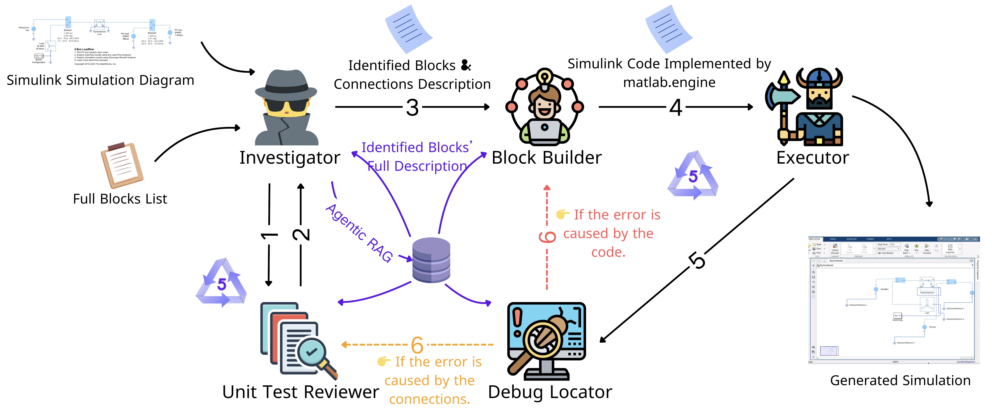

# SAGE: Simulation via Agent-based Generative Engine

SAGE is a multi-agent pipeline that generates Simulink simulation code from input diagrams.  
It leverages large language models, multimodal perception, and modular agentic workflows.

## 🧠 Concept

Given a Simulink-style simulation diagram as input (image format), SAGE produces the corresponding MATLAB Simulink code and runs the simulation automatically.

## 🧩 Concept Diagram

### System Overview

The system includes the following components:
- **Multimodal Investigator**: Detects blocks and connections from a simulation diagram.
- **Unit Test Reviewer**: Validates logical correctness of the extracted connections.
- **Block Builder**: Builds the simulation using `matlab.engine` in Python.
- **Debug Locator**: Identifies whether errors come from code logic or overlooked connection issues.

## 📺 Demo Videos

- [Demo 1: Generating a two-bus electrical system using 4.5 for the Investigator and o3_mini for the other agents.](SAGE_demo_two_bus_electrical_system_4_5.mp4)
- [Demo 2: Generating a two-bus electrical system using 4o for the Investigator and o3_mini for the other agents.](SAGE_demo_two_bus_electrical_system_4o.mp4)
- [Demo 3: Generating a bouncing_ball simulation using 4.5 for the Investigator and o3_mini for the other agents.](SAGE_demo_two_bus_bouncing_ball.mp4)
- [Demo 4: Generating a simulink_model using 4.5 for the Investigator and o3_mini for the other agents.](SAGE_demo_simulink_model.mp4)

## 🚧 Coming Soon
- Code release
- Documentation and setup guide
