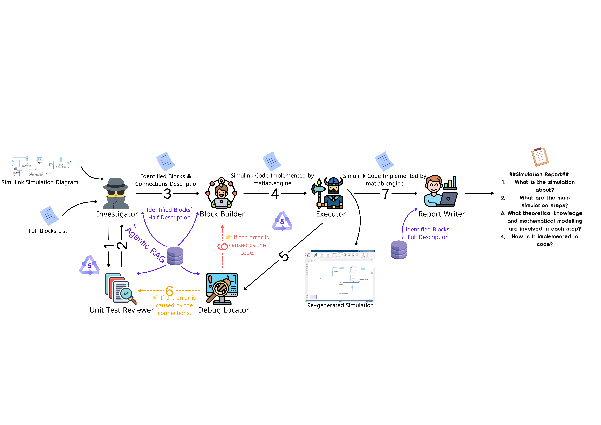

# MAGE：Multi-modal Agentic Data Generation Pipeline for Cross-domain Simulation Construction

MAGE is a multi-agent pipeline that generates Simulink simulation code from input diagrams using large language models, multimodal perception, and modular agentic workflows.

Despite recent advances in solving math and programming tasks, LLMs still struggle with simulation code generation. Even models like GPT-4.5 often fail to produce complete and correct code for tasks such as a bouncing ball simulation without human help.

We believe this is due to two key reasons:  
1. **Simulation requires deep domain-specific knowledge**, and related code is rarely open-sourced.  
2. **High-quality datasets** pairing expert knowledge with simulation code are expensive and require manual annotation by experts.

To address this, **MAGE proposes a reverse-engineering approach**: instead of generating simulation code from scratch, it uses widely available Simulink diagrams as input, and leverages LLMs' strength in code interpretation to produce executable simulations and structured reports.

## 🧠 Concept

Given a Simulink-style simulation diagram as input (image format) and a textual description, MAGE produces:
- the corresponding MATLAB Simulink code using `matlab.engine`
- a comprehensive simulation report including:
  1. What is the simulation about?
  2. What are the main simulation steps?
  3. What theoretical knowledge and mathematical modeling are involved?
  4. How is each step implemented in code?

These outputs can be formatted as `<question, answer>` or `<question, chain-of-thought, answer>` pairs, useful for supervised fine-tuning (SFT) and reinforcement learning training paradigms like PPO.

## 🛠️ System Overview

The system includes the following components:
- **Multimodal Investigator**: Detects blocks and connections from a simulation diagram.
- **Unit Test Reviewer**: Validates logical correctness of the extracted connections.
- **Block Builder**: Builds the simulation using `matlab.engine` in Python.
- **Executor**: Runs the simulation and returns results.
- **Debug Locator**: Identifies whether errors come from code logic or overlooked connection issues.
- **Report Writer**: Synthesizes a detailed explanation of simulation intent, theoretical background, step-by-step logic, and code implementation.
- **Database**: Provides supporting reference information, including block descriptions, code templates, and functional documentation.

This agentic architecture ensures a modular, interpretable, and extensible workflow for universal simulation data generation.

## 📺 Demo Videos

### 🔹 Demo 1: Generating a two-bus electrical system using 4.5 for the Investigator and o3_mini for the other agents.

---

### 🔹 Demo 2: Generating a two-bus electrical system using 4o for the Investigator and o3_mini for the other agents.

---

### 🔹 Demo 3: Generating a bouncing_ball simulation using 4.5 for the Investigator and o3_mini for the other agents.

---

### 🔹 Demo 4: Generating a simulink_model using 4.5 for the Investigator and o3_mini for the other agents.

## 🚧 Coming Soon
- Code release
- Documentation and setup guide
